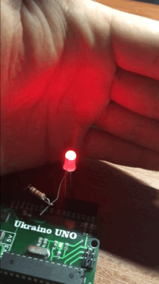

The avr bare-metal fast-PWM for burning imitation
---------------------------------------------------------------------------------
The researches have shown that candle has a 16 stages of burning by certain probability distribution.

More about researches [here](https://github.com/cpldcpu/CandleLEDhack).

The burning is based on [Linear congruential generator](https://en.wikipedia.org/wiki/Linear_congruential_generator).

### Execute:
- make clean hex
- make flash

### Clean
- make clean

## Demostration:  

